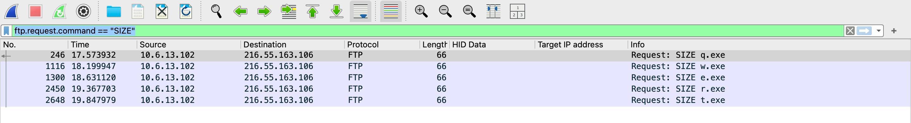
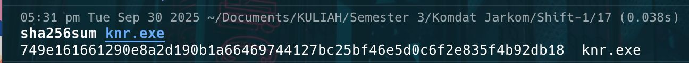

# Jarkom-Modul-01-2025-K34

| Nama | NRP |
|------ | ----- |
| Paundra Pujo Darmawan | 5027241008 |

**(Q1) Untuk mempersiapkan pembuatan entitas selain mereka, Eru yang berperan sebagai Router membuat dua Switch/Gateway. Dimana Switch 1 akan menuju ke dua Ainur yaitu Melkor dan Manwe. Sedangkan Switch 2 akan menuju ke dua Ainur lainnya yaitu Varda dan Ulmo. Keempat Ainur tersebut diberi perintah oleh Eru untuk menjadi Client.**

**(Q2) Karena menurut Eru pada saat itu Arda (Bumi) masih terisolasi dengan dunia luar, maka buat agar Eru dapat tersambung ke internet.**

**(Q3) Sekarang pastikan agar setiap Ainur (Client) dapat terhubung satu sama lain.**

**(Q4) Setelah berhasil terhubung, sekarang Eru ingin agar setiap Ainur (Client) dapat mandiri. Oleh karena itu pastikan agar setiap Client dapat tersambung ke internet.**

**(Q5) Ainur terkuat Melkor tetap berusaha untuk menanamkan kejahatan ke dalam Arda (Bumi). Sebelum terjadi kerusakan, Eru dan para Ainur lainnya meminta agar semua konfigurasi tidak hilang saat semua node di restart.**

**(Q6) Setelah semua Ainur terhubung ke internet, Melkor mencoba menyusup ke dalam komunikasi antara Manwe dan Eru. Jalankan file berikut (link file) lalu lakukan packet sniffing menggunakan Wireshark pada koneksi antara Manwe dan Eru, lalu terapkan display filter untuk menampilkan semua paket yang berasal dari atau menuju ke IP Address Manwe. Simpan hasil capture tersebut sebagai bukti.**

**(Q7) Untuk meningkatkan keamanan, Eru memutuskan untuk membuat sebuah FTP Server di node miliknya. Lakukan konfigurasi FTP Server pada node Eru. Buat dua user baru: ainur dengan hak akses write&read dan melkor tanpa hak akses sama sekali ke direktori shared. Buktikan hasil tersebut dengan membuat file teks sederhana kemudian akses file tersebut menggunakan kedua user.**

**(Q8) Ulmo, sebagai penjaga perairan, perlu mengirimkan data ramalan cuaca ke node Eru. Lakukan koneksi sebagai client dari node Ulmo ke FTP Server Eru menggunakan user ainur. Upload sebuah file berikut (link file). Analisis proses ini menggunakan Wireshark dan identifikasi perintah FTP yang digunakan untuk proses upload.**

**(Q9) Eru ingin membagikan "Kitab Penciptaan" di (link file) kepada Manwe. Dari FTP Server Eru, download file tersebut ke node Manwe. Karena Eru merasa Kitab tersebut sangat penting maka ia mengubah akses user ainur menjadi read-only. Gunakan Wireshark untuk memonitor koneksi, identifikasi perintah FTP yang digunakan, dan uji akses user ainur.**

**(Q10) Melkor yang marah karena tidak diberi akses, mencoba melakukan serangan dengan mengirimkan banyak sekali request ke server Eru. Gunakan command ping dari node Melkor ke node Eru dengan jumlah paket yang tidak biasa (spam ping misalnya 100 paket). Amati hasilnya, apakah ada packet loss? Catat average round trip time untuk melihat apakah serangan tersebut mempengaruhi kinerja Eru.**

**(Q11) Sebelum era koneksi aman, Eru sering menyelinap masuk ke wilayah Melkor. Eru perlu masuk ke node tersebut untuk memeriksa konfigurasi, namun ia tahu Melkor mungkin sedang memantau jaringan. Buktikan kelemahan protokol Telnet dengan membuat akun dan password baru di node Melkor kemudian menangkap sesi login Eru ke node Melkor menggunakan Wireshark. Tunjukkan bagaimana username dan password dapat terlihat sebagai plain text.**

**(Q12) Eru mencurigai Melkor menjalankan beberapa layanan terlarang di node-nya. Lakukan pemindaian port sederhana dari node Eru ke node Melkor menggunakan Netcat (nc) untuk memeriksa port 21, 80, dalam keadaan terbuka dan port rahasia 666 dalam keadaan tertutup.**

**(Q13) Setelah insiden penyadapan Telnet, Eru memerintahkan semua koneksi administratif harus menggunakan SSH (Secure Shell) untuk mengamankan jaringan. Lakukan koneksi SSH dari node Varda ke Eru. Tangkap sesi tersebut menggunakan Wireshark. Analisis dan jelaskan mengapa username dan password tidak dapat dilihat seperti pada sesi Telnet. Tunjukkan paket-paket terenkripsi dalam hasil capture sebagai bukti keamanan SSH.**

**(Q14) Setelah gagal mengakses FTP, Melkor melancarkan serangan brute force terhadap  Manwe. Analisis file capture yang disediakan dan identifikasi upaya brute force Melkor. nc 10.15.43.32 3401**

Setelah diberikan sebuah file yang disediakan, kita bisa connect ke service yang disediakan untuk menjawab pertanyaan pertanyaan yang diberikan. File tersebut merupakan network capture yang bisa dibuka menggunakan wireshark.

1. How many packets are recorded in the pcapng file? Format: int

Untuk menjawab pertanyaan tersebut, kita bisa membuka file yang sudah diberikan.

Bisa dilihat bahwa untuk melihat banyaknya paket yang terekam ada di kolom paling kanan. Dan kita bisa menggulir ke paling bawah untuk melihat total paket yang terekam.

Maka didapatkan bahwa total paketnya adalah `500358`

2. What are the user that successfully logged in? Format: user:pass

Untuk menjawab pertanyaan tersebut, pertama tama, kita bisa melihat response paket yang gagal dalam melakukan login. Lalu, kita bisa filter kebalikannya.

`http.response && !(data-text-lines contains "Invalid")`

Dan untuk mengetahui username dan password yang digunakan, kita bisa klik kanan paket tersebut dan Follow -> HTTP Stream. Maka kita bisa menemukan credential yang digunakan, `n1enna:y4v4nn4_k3m3nt4r1`.

3. In which stream were the credentials found? Format: int

Kita bisa melihat stream pada screenshoot pada soal nomor 3 diatas pada pojok kanan bawah, yaitu `41824`.

4. What tools are used for brute force? Format: Hydra v1.8.0-dev

Kita juga bisa melihat tool yang digunakan untuk brute force pada screenshoot nomor 3 diatas yaitu pada User-Agent: `Fuzz Faster U Fool v2.1.0-dev`

**FLAG: KOMJAR25{Brut3_F0rc3_mkMfCf8l0kT7un3lw5BxxkQ2v}**

**(Q15) Melkor menyusup ke ruang server dan memasang keyboard USB berbahaya pada node Manwe. Buka file capture dan identifikasi pesan atau ketikan (keystrokes) yang berhasil dicuri oleh Melkor untuk menemukan password rahasia. nc 10.15.43.32 3402**

Pada soal ini, kita diberikan attachment baru yang masih berupa captured network traffic. Kita bisa menyambungkan ke connection yang diberikan.

1. What device does Melkor use? Format: string

Untuk mengetahui tersebut, pertama-tama kita bisa buka file tersebut menggunakan wireshark dan mengetahui bahwa protocol yang di captured adalah USB. Kita bisa melihat pada paket ke 6, terdapat Interface Descriptor yang menyebutkan device yang digunakan.

Diketahui device yang digunakan adalah: `Keyboard`.

2. What did Melkor write? Format: string

Untuk mengetahui hal tersebut, kita bisa menggunakan script yang sudah publik, [CTF-USB-KEYBOARD-PARSER](https://github.com/shark-asmx/CTF-Usb_Keyboard_Parser). Dan kita bisa melihat apa yang di ketik oleh Melkor.

Maka didapatkan string yang di ketik oleh Melkor adalah `UGx6X3ByMHYxZGVfeTB1cl91czNybjRtZV80bmRfcDRzc3cwcmQ=`

3. What is Melkor's secret message? Format: string

Kita bisa mengetahui bahwa yang di ketik melkor adalah encoded base64, maka kita bisa decode string tersebut.

Maka didapatkan pesan tersembunyi nya adalah `Plz_pr0v1de_y0ur_us3rn4me_4nd_p4ssw0rd`.

**FLAG: KOMJAR25{K3yb0ard_W4rr10r_NGhAXCxOBCHXTdUD5SkQt9DAZ}**

**(Q16) Melkor semakin murka ia meletakkan file berbahaya di server milik Manwe. Dari file capture yang ada, identifikasi file apa yang diletakkan oleh Melkor. nc 10.15.43.32 3403**

1. What credential did the attacker use to log in? Format: user:pass

Kita bisa melihat bahwa captured network tersebut menggunakan protocol `ftp` untuk melakukan komunikasi, jadi kita bisa filter untuk menampilkan hanya paket yang menggunakan protokol `ftp` dan kita bisa mendapatkan kredensial yang digunakan.

Dapat diketahui bahwa kredensial yang digunakan adalah `ind@psg420.com:{6r_6e#TfT1p`

2. How many files are suspected of containing malware? Format: int

Pertama tama, pada screnshoot diatas, kita bisa melihat beberapa file yang ter transfer, lalu kita bisa menggunakan salah satu bagian dari ftp, yaitu requst command, untuk memfilter file yang di transfer, `ftp.request.command == "SIZE"`.

Dan dapat diketahui, terdapat `5` file yang mencurigakan.

Kita bisa export semua file yang di transfer menggunakan protokol `ftp` dengan klik kanan paket, follow -> TCP stream dan tinggal Save as.

3. What is the hash of the first file (q.exe)? Format: string

`ca34b0926cdc3242bbfad1c4a0b42cc2750d90db9a272d92cfb6cb7034d2a3bd`

4. What is the hash of the second file (w.exe)? Format: string

`08eb941447078ef2c6ad8d91bb2f52256c09657ecd3d5344023edccf7291e9fc`

5. What is the hash of the third file (e.exe)? Format: string

`32e1b3732cd779af1bf7730d0ec8a7a87a084319f6a0870dc7362a15ddbd3199`

6. What is the hash of the fourth file (r.exe)? Format: string

`4ebd58007ee933a0a8348aee2922904a7110b7fb6a316b1c7fb2c6677e613884`

7. What is the hash of the fifth file (t.exe)? Format: string

`10ce4b79180a2ddd924fdc95951d968191af2ee3b7dfc96dd6a5714dbeae613a`

**FLAG: KOMJAR25{Y0u_4r3_4_g00d_4nalyz3r_vrMxEP4WwKqQzHwi0Aen7WSGA}**

**(Q17) Manwe membuat halaman web di node-nya yang menampilkan gambar cincin agung. Melkor yang melihat web tersebut merasa iri sehingga ia meletakkan file berbahaya agar web tersebut dapat dianggap menyebarkan malware oleh Eru. Analisis file capture untuk menggagalkan rencana Melkor dan menyelamatkan web Manwe. nc 10.15.43.32 3404**

1. What is the name of the first suspicious file? Format: file.exe

Untuk mengetahui hal tersebut, kita bisa filter `http` dan melihat file yang di fetch.

Dapat diketahui, file yang mencurigakan adalah `Invoice&MSO-Request.doc`

2. What is the name of the second suspicious file? Format: file.exe

Bisa dilihat juga dari screenshoot diatas juga bahwa file kedua yaitu `knr.exe`

3. What is the hash of the second suspicious file (knr.exe)? Format: sha256

Bisa di export lewat: File -> Export Object -> HTTP. Dan kita bisa melihat hash nya.

Maka hash nya adalah `749e161661290e8a2d190b1a66469744127bc25bf46e5d0c6f2e835f4b92db18`

**FLAG: KOMJAR25{M4ster_4n4lyzer_t0GTVPicUaciXSoRYwRzGOUI8}**

**(Q18) Karena rencana Melkor yang terus gagal, ia akhirnya berhenti sejenak untuk berpikir. Pada saat berpikir ia akhirnya memutuskan untuk membuat rencana jahat lainnya dengan meletakkan file berbahaya lagi tetapi dengan metode yang berbeda. Gagalkan lagi rencana Melkor dengan mengidentifikasi file capture yang disediakan agar dunia tetap aman. nc 10.15.43.32 3405**

1. How many files are suspected of containing malware? Format: int

Untuk mengetahui jumlahnya, kita bisa membuka file pcap yang sudah diberikan terlebih dahulu. Sangat banyak protokol yang digunakan, oleh karena itu, kita bisa filter satu satu terlebih dahulu. Lalu, Ditemukan file dengan nama yang mencurigakan pada protokol `smb`. Dan terdapat 2 file yang mencurigakan

Maka dapat diketahui bahwa terdapat `2` file yang mengandung malware.

2. What is the name of the first malicious file? Format: file.exe

Dari screenshoot diatas, file pertamanya adalah `d0p2nc6ka3f_fixhohlycj4ovqfcy_smchzo_ub83urjpphrwahjwhv_o5c0fvf6.exe`

3. Apa nama file berbahaya yang kedua? Format: file.exe

Dari screenshoot diatas, file keduanya adalah `oiku9bu68cxqenfmcsos2aek6t07_guuisgxhllixv8dx2eemqddnhyh46l8n_di.exe`

Kita bisa ekstrak file diatas melalui: File -> Export Objects -> SMB dan mendapatkan hash dari kedua file tersebut.

4. What is the hash of the first malicious file? Format: sha256

`59896ae5f3edcb999243c7bfdc0b17eb7fe28f3a66259d797386ea470c010040`

5. What is the hash of the second malicious file? Format: sha256

`cf99990bee6c378cbf56239b3cc88276eec348d82740f84e9d5c343751f82560`

**FLAG: KOMJAR25{Y0u_4re_g0dl1ke_PjPLhWGPWfpWYVJJiNZbJHcWz}**

